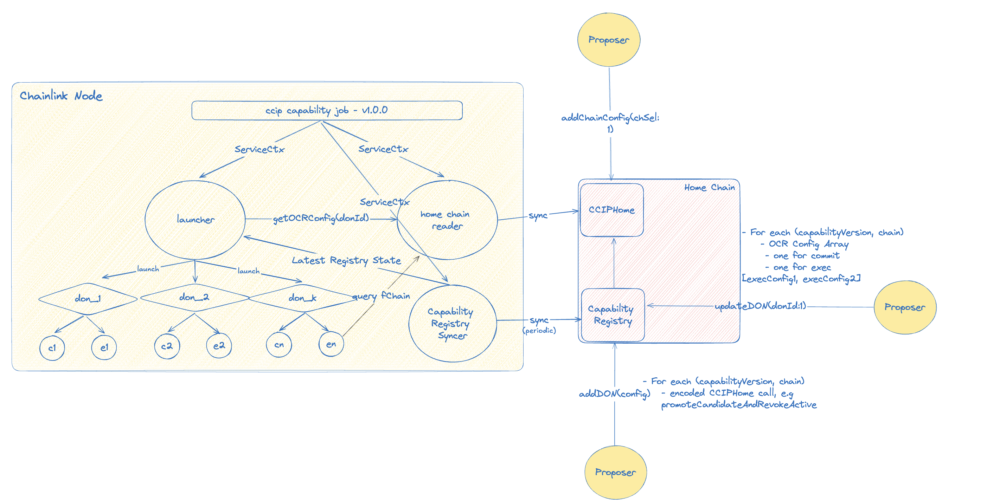

# CCIP Capability Launcher

The CCIP capability launcher is responsible for listening to
[Capabilities Registry](../../../../contracts/src/v0.8/keystone/CapabilitiesRegistry.sol) (CR) updates
for the particular CCIP capability (labelled name, version) pair and reacting to them. In
particular, there are three kinds of events that would affect a particular capability:

1. DON Creation: when `addDON` is called on the CR, the capabilities of this new DON are specified.
If CCIP is one of those capabilities, the launcher will launch a commit and an execution plugin
with the OCR configuration specified in the DON creation process. See
[CCIPHome.sol](../../../../contracts/src/v0.8/ccip/capability/CCIPHome.sol), specifically `struct OCR3Config`,
for more details on what the OCR configuration contains.
2. DON update: when `updateDON` is called on the CR, capabilities of the DON can be updated. In the
CCIP use case specifically, `updateDON` is used to update OCR configuration of that DON. Updates
follow the active/candidate deployment pattern (explained in detail below with a state diagram). In this
scenario the launcher must either launch brand new instances of the commit and execution plugins
(in the event a candidate deployment is made) or promote the currently running candidate instance to be
the active instance.
3. DON deletion: when `deleteDON` is called on the CR, the launcher must shut down all running plugins
related to that DON. When a DON is deleted it effectively means that it should no longer function.
DON deletion is permanent.

## Architecture Diagram



The above diagram shows how the CCIP capability launcher interacts with the rest of the components
in the CCIP system.

The CCIP capability job, which is created on the Chainlink node, will spin up the following services, in
the following order:

* Home chain contract reader
* Home chain capability registry syncer
* Home chain CCIPHome reader
* CCIP Capability Launcher

The order in which these services are started is important due to the dependencies some have on others; i.e
the capability launcher depends upon the home chain `CCIPHome` reader and the home chain capability registry syncer;
these in turn depend on the home chain contract reader.

The home chain `CCIPHome` reader reads the [CCIPHome.sol](../../../../contracts/src/v0.8/ccip/capability/CCIPHome.sol)
contract deployed on the home chain (typically Ethereum Mainnet, though could be "any chain" in theory).

ETHected into the launcher is the [OracleCreator](../types/types.go) object which knows how to spin up CCIP
oracles (both bootstrap and plugin oracles). This is used by the launcher at the appropriate time in order
to create oracle instances but not start them right away.

After all the required oracles have been created, the launcher will start and shut them down as required
in order to match the configuration that was posted on-chain in the Capability Registry and the CCIPHome.sol contract.

## Config State Diagram

CCIP's active/candidate deployment paradigm is intentionally kept as simple as possible.

The below state diagram (copy/pasted from CCIPHome.sol's doc comment) is relevant:

```solidity
/// @dev This contract is a state machine with the following states:
/// - Init: The initial state of the contract, no config has been set, or all configs have been revoked.
///   [0, 0]
///
/// - Candidate: A new config has been set, but it has not been promoted yet, or all active configs have been revoked.
///   [0, 1]
///
/// - Active: A non-zero config has been promoted and is active, there is no candidate configured.
///   [1, 0]
///
/// - ActiveAndCandidate: A non-zero config has been promoted and is active, and a new config has been set as candidate.
///   [1, 1]
///
/// The following state transitions are allowed:
/// - Init -> Candidate: setCandidate()
/// - Candidate -> Active: promoteCandidateAndRevokeActive()
/// - Candidate -> Candidate: setCandidate()
/// - Candidate -> Init: revokeCandidate()
/// - Active -> ActiveAndCandidate: setCandidate()
/// - Active -> Init: promoteCandidateAndRevokeActive()
/// - ActiveAndCandidate -> Active: promoteCandidateAndRevokeActive()
/// - ActiveAndCandidate -> Active: revokeCandidate()
/// - ActiveAndCandidate -> ActiveAndCandidate: setCandidate()
///
/// This means the following calls are not allowed at the following states:
/// - Init: promoteCandidateAndRevokeActive(), as there is no config to promote.
/// - Init: revokeCandidate(), as there is no config to revoke
/// - Active: revokeCandidate(), as there is no candidate to revoke
/// Note that we explicitly do allow promoteCandidateAndRevokeActive() to be called when there is an active config but
/// no candidate config. This is the only way to remove the active config. The alternative would be to set some unusable
/// config as candidate and promote that, but fully clearing it is cleaner.
///
///       ┌─────────────┐   setCandidate     ┌─────────────┐
///       │             ├───────────────────►│             │ setCandidate
///       │    Init     │   revokeCandidate  │  Candidate  │◄───────────┐
///       │    [0,0]    │◄───────────────────┤    [0,1]    │────────────┘
///       │             │  ┌─────────────────┤             │
///       └─────────────┘  │  promote-       └─────────────┘
///                  ▲     │  Candidate
///        promote-  │     │
///        Candidate │     │
///                  │     │
///       ┌──────────┴──┐  │  promote-       ┌─────────────┐
///       │             │◄─┘  Candidate OR   │  Active &   │ setCandidate
///       │    Active   │    revokeCandidate │  Candidate  │◄───────────┐
///       │    [1,0]    │◄───────────────────┤    [1,1]    │────────────┘
///       │             ├───────────────────►│             │
///       └─────────────┘    setSecondary    └─────────────┘
///
```

In the `Active & Candidate` state, there are effectively four plugins running - one (commit, execution) pair for the
active configuration, and one (commit, execution) pair for the candidate configuration. However, only the active
configuration will actively be transmitting OCR reports on-chain, where as the green configuration will be "dry running",
i.e doing everything except transmitting.

This allows us to test out new configurations without committing to them immediately.
